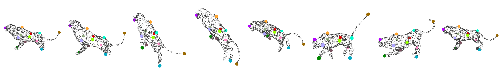
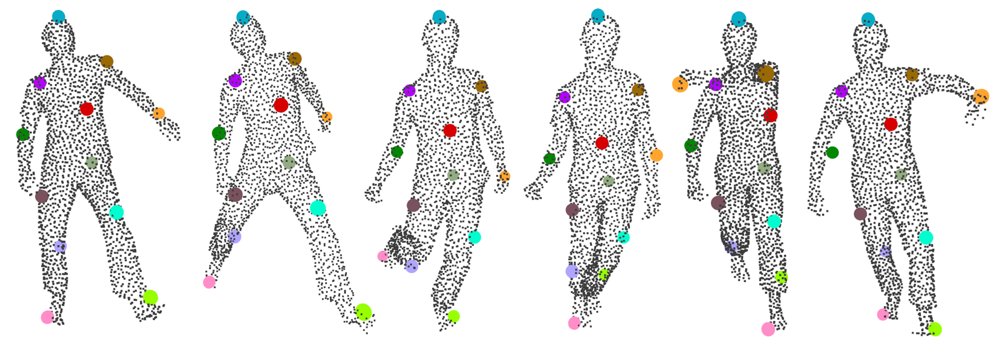

# SelfGeo
This repository contains the code of "[_**SelfGeo: Self-supervised and Geodesic-consistent Estimation of Keypoints on Deformable Shapes**_](https://www.arxiv.org/pdf/2408.02291)", which has been accepted in the ECCV2024.

**Authors:** [Mohammad Zohaib](https://zohaibmohammad.github.io/), [Luca Cosmo](https://www.unive.it/data/people/8436013), [Alessio Del Bue](https://www.iit.it/it/people-details/-/people/alessio-delbue)

<p align="center">
  
</p>


**Abstract:**  
<p align="justify">  Unsupervised 3D keypoints estimation from Point Cloud Data
(PCD) is a complex task, even more challenging when an object shape is
deforming. As keypoints should be semantically and geometrically consistent across all the 3D frames – each keypoint should be anchored to
a specific part of the deforming shape irrespective of intrinsic and extrinsic motion. This paper presents, "SelfGeo", a self-supervised method
that computes persistent 3D keypoints of non-rigid objects from arbitrary PCDs without the need of human annotations. The gist of SelfGeo
is to estimate keypoints between frames that respect invariant properties
of deforming bodies. Our main contribution is to enforce that keypoints
deform along with the shape while keeping constant geodesic distances
among them. This principle is then propagated to the design of a set
of losses which minimization let emerge repeatable keypoints in specific
semantic locations of the non-rigid shape. We show experimentally that
the use of geodesic has a clear advantage in challenging dynamic scenes
and with different classes of deforming shapes (humans and animals). </p>


# Installation
We highly recommend running this project with a [conda environment](https://docs.conda.io/projects/conda/en/latest/user-guide/tasks/manage-environments.html). The code is tested on ```Python 3.6.12```, ```Torch 1.10.1```, ```Torchvision 0.11.2```. We recommend using ```Python 3.6+``` and installing all the dependencies as provided in "selfgeo.yml". Create a conda environment by following:
```
git clone https://github.com/IIT-PAVIS/SelfGeo.git
cd SelfGeo

conda env create -f selfgeo.yml
conda activate sg
```
  
# Datasets
We use the following four datasets; 
[CAPE](https://cape.is.tue.mpg.de/dataset.html), [Deforming Things 4D](https://github.com/rabbityl/DeformingThings4D),
[ITOP](https://zenodo.org/records/3932973), and [DFAUST](https://dfaust.is.tue.mpg.de/).
All the datasets are publically available.
We provide a sample set for the CAPE and Deforming Things 4D in the folder "dataset" for an initial start.

**CAPE dataset:**

We proved the processed sample set (containing PCDs and geodesics). 
The data processing steps are described for the Deforming Things 4D dataset.
We use the following structure for the CAPE dataset:
```
CAPE/
  |_ train
      |__ geodesic
            |__ *.npy (containing the geodesics)
            ...
      |__ pcd
            |__ *.npy (containing the point clouds)
            ...      
  |_ test
      |__ geodesic
            |__ *.npy (containing the geodesics)
            ...
      |__ pcd
            |__ *.npy (containing the point clouds)
            ...      
  |_ val
      |__ geodesic
            |__ *.npy (containing the geodesics)
            ...
      |__ pcd
            |__ *.npy (containing the point clouds)
            ...      
```


**Deforming Things 4D dataset:**

In the dataset directory **/dataset/DeformingThings4D/**, we provide a sample of the original dataset **original_dataset**, **sdk.py** and **splits**.
- The "original_dataset" contains two categories (tigerD8H_Jump0 and tigerD8H_Jump1) of the Deforming Things 4D dataset. Each category contains screenshots of the frames and category.anime file.
The remaining categories can be added in the same folder.
- The "sdk.py" can be used to generate PCDs, Geodesics and to separate offsets required for PCK computation.
- To generate the geodesics and pcds, uncomment ```create_pcds_geodesics()``` and run the "sdk.py" as: ```python dataset/DeformingThings4D/sdk.py```.
A folder **pcds_geodesics** will be created in the **/dataset/DeformingThings4D/** directory.
- To generate the first frame and the offsets of the next frames, uncomment ```create_pcds_and_correspondences()``` and run the "sdk.py" as: ```python dataset/DeformingThings4D/sdk.py```.
A folder **correspondences_for_pck** will be created in the **/dataset/DeformingThings4D/** directory.
- The "splits" folder contains split files for test, train and validation. We just provide splits for the provided sample dataset. One can add splits for every category.
- Now, **/dataset/DeformingThings4D/** should contains the followings;
```
DeformingThings4D/
  |_ correspondences_for_pck
      |__ tigerD8H_Jump0
            |__ tigerD8H_Jump0.npz
            ...
      |__ tigerD8H_Jump1
            |__ tigerD8H_Jump1.npz
            ...      
  |_ original_dataset
      |__ tigerD8H_Jump0
            |__ screenshots
            |__ tigerD8H_Jump0.anime
            ...
      |__ tigerD8H_Jump1
            |__ screenshots
            |__ tigerD8H_Jump1.anime
            ...   
  |_ pcds_geodesics
      |__ geodesic
           tigerD8H_Jump0
            |__ 0_tigerD8H_Jump0.npy
            |__ 1_tigerD8H_Jump0.npy
            ...   
	   tigerD8H_Jump1
            |__ 0_tigerD8H_Jump1.npy
            |__ 1_tigerD8H_Jump1.npy
            ...   
      |__ pcds
           tigerD8H_Jump0
            |__ 0_tigerD8H_Jump0.npy
            |__ 1_tigerD8H_Jump0.npy
            ...   
	   tigerD8H_Jump1
            |__ 0_tigerD8H_Jump1.npy
            |__ 1_tigerD8H_Jump1.npy
            ...     
  |_ splits
      |__ tigerD8H_test.txt
      |__ tigerD8H_train.txt
      |__ tigerD8H_val.txt
```


# Training 
SelfGeo can be trained for any deformable dataset. These instructions show how the **train.py** can be used 
for CAPE and Deforming Things 4D dataset. 

First, set the training parameters using the configuration file "config/config_cape.yaml" or "config/config_deforming_Things.yaml". For example:

For the CAPE dataset:
  ```
    split: train  # train the network
    class_name: human   # Remains the same for CAPE dataset
    pcd_root: dataset/CAPE_00032   # directory of the CAPE dataset
    best_model_path: 'path_to_best_weights' 
  ```
For the Deforming Things 4D dataset:
  ```
    split: train  # train the network
    class_name: tigerD8H  # Change the object’s name
    pcd_root: dataset/DeformingThings4D/pcds_geodesics  # pcds and geodesics created from the Deforming Things 4D dataset
    best_model_path: 'path_to_best_weights' 
  ```

Second, open **train.py** and change the data loader and hydra configuration. 
For example:

For the CAPE dataset:
  ```
    data loader: import data_loader_cape as dataset
    hydra_config: @hydra.main(config_path='config', config_name='config_cape')
  ```
For the Deforming Things 4D dataset:
  ```
    data loader: import data_loader_deformingThings4d as dataset
    hydra_config: @hydra.main(config_path='config', config_name='config_deforming_Things') 
  ```

From the SelfGeo directory, run ```python train.py``` for starting the training: 
Follow the training progress using **output/train/class_name/**. The best weights will be saved in the same folder with the name **Best_model_class_name_12kp.pth**.
By default, the configurations are set for the CAPE dataset.
  
# Inference
  Set the parameters using the configuration file "config/config.yaml" or "config/config_deforming_Things.yaml" as:

For the CAPE dataset:
  ```
    split: test  # test the network
    class_name: human   # Remains the same for CAPE dataset
    pcd_root: dataset/CAPE_00032   # directory of the CAPE dataset
    best_model_path: outputs/train/human/Best_model_human_12kp.pth # Path of the trained model
  ```
For the Deforming Things 4D dataset:
  ```
    split: train  # train the network
    class_name: tigerD8H  # Change the object’s name
    pcd_root: dataset/DeformingThings4D/pcds_geodesics  # pcds and geodesics created from the Deforming Things 4D dataset
    best_model_path: outputs/train/tigerD8H/Best_model_tigerD8H_12kp.pth  # tigerD8H is the class_name
  ```

Same as before, open **test.py** and change the data loader and hydra configuration. For example:

For the CAPE dataset:
  ```
    data loader: import data_loader_cape as dataset
    hydra_config: @hydra.main(config_path='config', config_name='config_cape')
  ```
For the Deforming Things 4D dataset:
  ```
    data loader: import data_loader_deformingThings4d as dataset
    hydra_config: @hydra.main(config_path='config', config_name='config_deforming_Things') 
  ```
From the SelfGeo directory, run ```python test.py``` for testing: 
Find the results in directory **output/test/class_name/**. 


**Computing Probability of Correct Keypoints (PCK)**
- We only compute PCK for the DeformingThings4D dataset, as it contains the offsets between the PCD frames.
- There should be the "correspondences_for_pck" folder in the dataset directory,
which could be generated by running the "sdk.py" (as discussed in dataset section).
Otherwise, data will not be loaded and therefore,  PCK will not be computed.
- Set the path of 'pcd_root_pck' in the configure file (config_deforming_Things.yaml) as ```pcd_root_pck: dataset/DeformingThings4D/correspondences_for_pck```
- From the SelfGeo directory, run ```python test_pck_deformingThings.py```.
- Find the results (log file and visualizations) in directory **output/test/tigerD8H/**.


# Visualizations
To save the qualitative results (visualizations), you can run ```python test.py```, keeping ```save_results: True```
in the "config_cape.yml" or "config_deforming_Things.yml" file. You will find the output files in the "outputs/test/class_id/*_visualizations".

The estimated keypoints on the Tiger should look like:
<p align="center">
  
</p>

The estimated keypoints on the CAPE human should look like:
<p align="center">
  
</p>


## Cite us:
If you use this project for your research, please cite as:
```
@InProceedings{zohaib2024selfgeo,
    author    = {Zohaib, Mohammad and Cosmo, Luca and Del Bue, Alessio},
    title     = {SelfGeo: Self-supervised and Geodesic-consistent Estimation of Keypoints on Deformable Shapes},
    booktitle = {Proceedings of the European Conference on Computer Vision (ECCV)},
    month     = {July},
    year      = {2024},
    pages     = {--}
}

```

## Previous related works:
3. [SC3K: Self-supervised and Coherent 3D Keypoints Estimation from Rotated, Noisy, and Decimated Point Cloud Data](https://github.com/IIT-PAVIS/SC3K) 
2. [CDHN: Cross-Domain Hallucination Network for 3D Keypoints Estimation](https://papers.ssrn.com/sol3/papers.cfm?abstract_id=4349267)
1. [3D Key-Points Estimation from Single-View RGB Images](https://link.springer.com/chapter/10.1007/978-3-031-06430-2_3)

   
## Acknowledgements:
<p align="justify"> We would like to acknowledge <a href="https://www.iit.it/it/people/pietro-morerio">Pietro Morerio</a>
 for fruitful discussions. This work was carried out within the frameworks of the project
“RAISE - Robotics, and AI for Socio-economic Empowerment” and the PRIN
2022 project n. 2022AL45R2 (EYE-FI.AI, CUP H53D2300350-0001). This work
has been supported by European Union - NextGenerationEU. </p>


